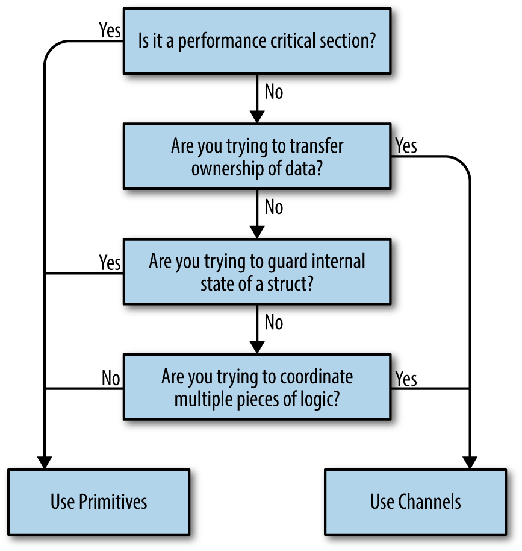

# 코드 모델링: 순차적인 프로세스 간의 통신

### 동시성과 병렬성의 차이

> 동시성은 코드의 속성이고 병렬 처리는 실행 중인 프로그램의 속성이다 

- 프로그램 각 부분이 병렬적으로 실행되는 것처럼 보이지만 실제로는 구별할 수 없을 정도로 빠르게 순차적으로 실행된다 
- 서로 다른 프로그램 간의 시간을 공유하기 위해 CPU 컨텍스트가 전환되며, 
- 시간을 매우 잘게 쪼개기 때문에 작업이 병렬적으로 실행되는 것처럼 보인다 
- 두 개의 코어가 았는 시스템에서 동일한 바이너리를 실행하면 프로그램의 각 부분이 실제로 병렬로 실행 중일 수 있다 

1. 우리는 병렬로 실행되기를 바라면서 동시성 코드를 작성한 것이다 
2. 동시성 코드가 실제로 병렬로 실행되는지 여부를 모를 수도 있다 
3. 병렬 처리인지 아닌지는 시간이나 컨텍스트에 의해 결정된다 

각 컴퓨터는 컨텍스트에 해당되며 개별 컴퓨터에서 실행되는 프로세스들은 동시에 실행되는 연산에 해당된다

### CSP란 무엇인가?

상호작용하는 순차적 프로세스들 Communicating Sequential Processes

> 프로그래밍에서 두 가지 기본 요소인 입력 및 출력이 간과되고 있으며, 특히 동시에 실행되는 코드의 경우에는 더욱 그렇다 

### 동시성을 지원하는 언어의 장점

- 많은 언어는 보통 OS 스레드 및 메모리 접근 동기화 수준에서 언어 추상화 체인을 끝낸다 
- Go는 다른 방식을 사용해 고루틴 및 채널의 개념으로 이를 대체한다 
- 고루틴은 스레드와 채널은 뮤텍스와 비교할 수 있다 

고루틴은 병렬성 측명을 고민할 필요가 없도록 도와주며 본연의 동시성 수준에 가깝게 문제를 모델링하도록 한다 

Go 런타임은 고루틴을 OS 스레드에 자동으로 다중화하고 스케줄링을 관리한다 

문제를 모델링한 방법을 변경하지 않고도 런타임을 최적화할 수 있다는 것을 의미한다 

동시성과 병렬성의 분리는 또 다른 장점으로 여겨진다 

> Go 런타임 고루틴의 스케줄리을 관리해주기 때문에 고루틴이 I/O를 기다리면서 멈춰 있는지를 검사할 수 있고 고루틴에 멈춰 있지 않은 OS 스레드를 지능적으로 재할당 할 수 있다 

동시성 방식으로 모델링된 문제 공간의 양이 늘어난다 

### Go 동시성에 대한 철학

> 메모리 공유를 사용해 통신하지 마라. 대신 통신을 통해 메모리를 공유하라 

> 통신을 통해 메모리를 공유하고 메모리 공유를 통해 통신하지 말라

Go는 sync 패키지에서 전통적인 잠금 매커니즘을 제공한다. 대부분 wkarma answpsms  채널이나 전통적인 잠금 중 하나를 사용해 해결할 수 있다 

- 결정트리 

  1. 데이터 소유권을 이전하려 하는가 

     결과를 산출하는 코드가 있고 그 결과를 또 다른 코드와 공유하려는 경우 실제로 수행하는 작업은 해당 데이터 소유권을 이전하는 것이다 

     데이터에는 하나의 소유자가 있으며 동시에 실행되는 프로그램들을 안전하게 만드는 한 방법은 한번에 하나의 동시 컨텍스트만 데이터 소유권을 가지게 하는 것이다 

     채널은 한 번에 하나의 동시 컨텍스트만 데이터 소유권을 가져야 한다는 의도를 채널 타입에 인코딩함으로써 메모리 소유권 개념을 전달 할 수 있도록 도와준다 

     적은 비용으로 메모리 내부 큐를 구현하기 위한 버퍼링된 채널을 생성하고 소비자와 생상자를 분리할 수 있다 

     채널을 사용하면 동시성 코드를 다른 동시성 코드와 함께 구성할 수 있다 

     