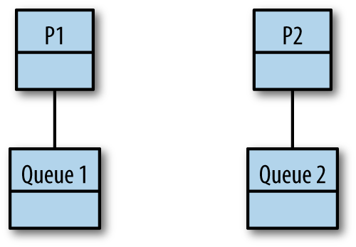
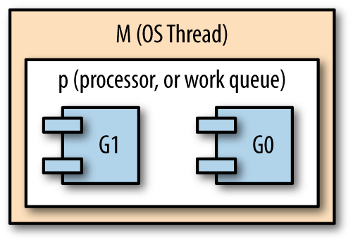

# 고루틴과 Go 런타임

## 작업 가로채기

1. 포크 시점에서 이 스레드와 연관된 데큐의 끝에 작업을 추가한다 
2. 스레드가 유휴 상태이면 임의의 다른 스레드와 관련된 데큐의 앞에서 작업을 가로챈다 
3. 아직 실현되지 않은 합류 지점 (즉 아직 완료되지 않은 고루틴과 동기화)에서 스레드 자체 데큐의 꼬리 부분을 제거한다 
4. 스레드의 데큐 양쪽이 모두 비어있는 경우 
   - 조인을 지연시킨다 
   - 임의의 스레드와 관련된 데큐의 앞쪽에서 작업을 가로챈다 



```go
var fib func(n int) <-chan int
fib = func(n int) <-chan int {
    result := make(chan int)
    go func() {
        defer close(result)
        if n <= 2 {
            result <- 1
            return
        }
        result <- <-fib(n-1) + <-fib(n-2)
    }()
    return result
}

fmt.Printf("fib(4) = %d", <-fib(4))
```


## 작업 또는 연속 가로채기

포크-조인 패러다임에서는 두 가지 옵션, 작업과 연속이 있다 

```go
var fib func(n int) <-chan int
fib = func(n int) <-chan int {
    result := make(chan int)
    go func() { 1
        defer close(result)
        if n <= 2 {
            result <- 1
            return
        }
        result <- <-fib(n-1) + <-fib(n-2)
    }()
    return result 2
}

fmt.Printf("fib(4) = %d", <-fib(4))
```

실행 스레드가 실현되지 않은 합류 지점에 도달하면 스레드는 실행을 일시 중지하고 작업 가로채기를 수행한다 

작업이 수행되는 동안 조인이 뒤로 미뤄지기 때문에 이를 조인 지연이라고 한다 

작업 가로채기와 연속 가로채기 알고리즘은 둘 다 조인을 지연시키지만 지연이 얼마나 자주 발생하는지에는 상당한 차이가 있다 


Go 스케불러 세가지 메인 컨셉

- G : 고루틴
- M : OS 스레드 (machine)
- P : 컨텍스트 (processor)


Go 런타임에서는 M이 시작되고 

M이 P를 호스트한 다음

P는 G를 스케줄링하고 호스트한다 



기본 설정은 호스트 시스템의 논리 CPU 당 하나의 컨텍스트가 존재한다 

Go 런타임이 가비지 컬렉션 및 고루틴 등을 관리하는 데 도움이 되는 OS 스레드는 코어보다 더 많거나 적을 수 있다

모든 컨텍스트를 호스팅 처리할 수 있을 만큼 충분한 OS 스레드가 언제나 존재한다


#### 입출력이나 Go 의 런타임 외부에서 시스템 콜을 통해 고루틴 중 하나가 차단된 경우

OS 스레드에서 컨텍스트를 분리해 컨텍스트를 대기 상태가 아닌 다른 OS 스레드로 넘겨 줄 수 있다 

컨텍스트가 추가적인 고루틴을 스케줄링할 수 있으므로 런타임은 호스트 시스템의 CPU 활성 상태를 유지한다 


